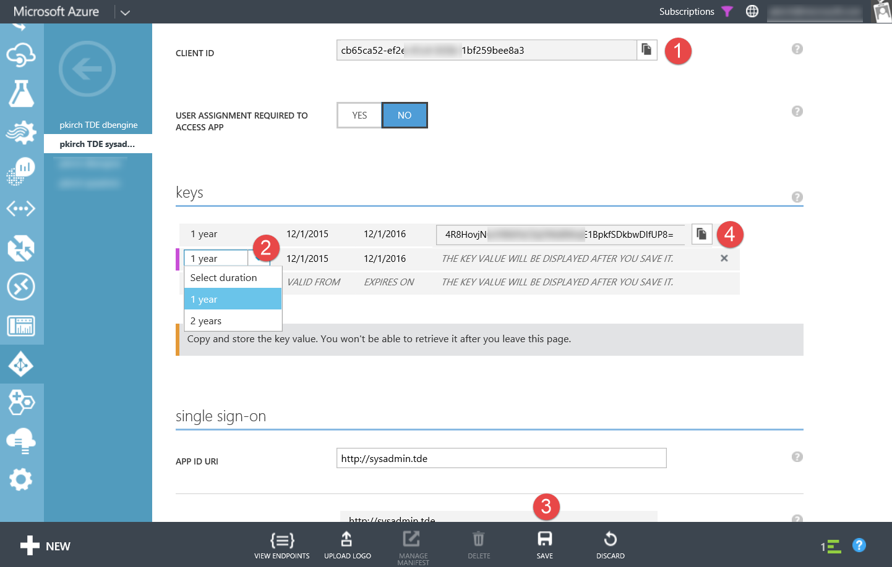

# Tutorial für PASS Camp 2015
## Datenbankverschlüsselung von SQL Server 2014 mit Azure Key Vault

Dieses Tutorial beinhaltet folgende Übungen:

* Übung 1: SQL Server VM erstellen
* Übung 2: Azure PowerShell 1.0 (preview) installieren
* Übung 3: Dienstkonten im Azure AD erstellen
* Übung 4: Azure Key Vault erstellen & konfigurieren
* Übung 5: SQL Server Connector installieren
* Übung 6: SQL Server konfigurieren, Azure Key Vault als EKM Provider zu nutzen
* Übung 7: Master Key konfigurieren
* Übung 8: Login und Credentials für die DB Engine konfigurieren
* Übung 9: Transparente Datenbankverschlüsselung konfigurieren

### Übung 1: SQL Server VM erstellen

Wir starten das Tutorial mit der Bereitstellung einer VM mit dem SQL Server, 
da die Bereitstellung ein paar Minuten dauern kann. 
Während der Bereitstellung können wir dann bereits mit anderen Aufgaben fortfahren.

Zuerst erstellen wir uns eine VM mit SQL Server über das **neue Portal**. 
Wir verwenden das neue Portal, da wir für unsere SQL Server VM eine DS-Maschine erstellen möchte, 
welche nur über das neue Portal auswählbar ist.

#### Schritt 1: Vorlage auswählen

#### Schritt 2: Basics

#### Schritt 3: Settings

#### Schritt 4: Summary

#### Schritt 5: Depoyment Started

### Übung 2: Azure PowerShell 1.0 (preview) installieren

#### Schritt 1: Windows Management Framework (WMF) 5.0 Production Preview installieren

WMF 5.0 ist auf Windows 10 vorinstalliert; auf dem Windows Server 2012 R2 noch nicht. 
Daher müssen wir das Framework vorher installieren. Nach der Installation ist ein Neustart notwendig.

Download: http://www.microsoft.com/en-us/download/details.aspx?id=48729

#### Schritt 2: Azure PowerShell 1.0 (preview) installieren

Eine neue PowerShell-Session oder die PowerShell ISE als Administrator öffnen und folgende Befehle ausführen.

<pre>
Set-ExecutionPolicy RemoteSigned  
Install-Module AzureRM  
Install-AzureRM  
Login-AzureRmAccount  
</pre>

Die Installation sollte ca. 5 Minuten dauern.

### Übung 3: Dienstkonten im Azure AD erstellen

Für den Azure Key Vault benötigen wir zwei Dienstkonten im Azure Active Directory.

Ein Dienstkonto wird für den sysadmin erstellt, das zweite für die DB Engine.

#### Schritt 1: Neue Anwendungen im Azure AD erstellen

Die Dienstkonten werden in Form von Anwendungen im Azure AD erstellt.

**Die folgenden beiden Schritte müssen Sie zweimal durchführen. 
Einmal für den sysadmin und einmal für die DB Engine.**

#### Schritt 2: Neue Anwendung: Schritt 1

Name vergeben und die Option Web Application ausgewählt lassen.

#### Schritt 3: Neue Anwendung: Schritt 2

Eine Anwendung im Azure AD benötigt eine Sign-On URL und eine App ID URI. 
Der SQL Server Connector, den wir im späteren Verlauf verwenden, benötigt diese Angaben nicht. 
Allerdings müssen wir diese Angaben trotzdem eintragen, daher sind hier beliebige (gültige) 
URLs und URIs akzeptiert werden.

#### Schritt 4: Neue Anwendung fertig erstellt

Am Ende sollten wie im folgenden Beispiel zwei neue Anwendungen im Azure AD gelistet sein.

#### Schritt 5: Client IDs und Keys der Dienstkonsten

In der nächsten Übung benötigen Sie die Client IDs und die Keys der Dienstkonten.

Diese finden Sie jeweils in der Konfiguration der AAD-Anwendungen.

Die Client ID ist direkt kopierbar.

Die Keys müssen für das Dienstkonto erst erstellt werden. Dazu ist die Gültigkeitsdauer 
auszuwählen und die Änderung abzuspeichern. Nach dem Speichern steht der Key **einmalig** zum 
Kopieren zur Verfügung.

### Übung 4: Azure Key Vault erstellen & konfigurieren

Eine PowerShell-Datei mit den wichtigsten Schritten ist hier im Repository zu finden:  
[Create-KeyVault](Create-KeyVault.ps1) 
[Download](https://raw.githubusercontent.com/pkirch/tutorial-azurekeyvault/master/tde-sqlsvr/Create-KeyVault.ps1)

### Übung 5: SQL Server Connector installieren

Auf dem Server muss der SQL Server Connector für Azure Key Vault installiert werden.

Download: http://go.microsoft.com/fwlink/p/?LinkId=521700  
(Ggf. Downloads im IE erlauben, indem die erweiterte Sicherheit für den IE im Server Manager 
deaktiviert wird.)

Wichtig für dieses Tutorial: bitte bei der Installation die Beispieldateien mitinstallieren lassen. 
Die Beispieldateien werden standardmäßig in den folgenden Pfad installiert:  
<pre>C:\Program Files\SQL Server Connector for Microsoft Azure Key Vault\Samples</pre>

### Übung 6: SQL Server konfigurieren, Azure Key Vault als EKM Provider zu nutzen

Wir öffnen die Beispieldatei 'Setup Credentials.sql'.

<code><pre>
USE master;
CREATE CREDENTIAL sysadmin_ekm_cred 
    WITH IDENTITY = 'ContosoKeyVault', 
    SECRET = 'CLIENDTIDWITHOUTHYPENSCLIENTSECRET'
FOR CRYPTOGRAPHIC PROVIDER AzureKeyVault_EKM_Prov 

-- Add the credential to the SQL Server administrators domain login 
ALTER LOGIN [<domain>/<login>]
ADD CREDENTIAL sysadmin_ekm_cred;
</pre></code>

Folgende Anpassungen müssen vorgenommen werden.

1. IDENTITY muss auf den Namen des erstellten Azure Key Vaults gesetzt werden.  
2. SECRET besteht auf der Client ID (ohne Bindestriche!) und in direktem Anschluss dem Key.  
3. Der Login muss auf das Konto gesetzt werden, das Admin-Berechtigungen besitzt.

Nach diesen Anpassungen die Abfrage ausführen.

### Übung 7: Master Key konfigurieren

Wir öffnen die Beispieldatei 'TDE Sample.sql' und kopieren nur den ersten Block (inkl. dem USE-Statement).

<pre>
USE [MASTER]

-- Use the EKM to open the asymmetric KEK that was previously created in the 
-- Key Vault

CREATE ASYMMETRIC KEY TDE_KEY  
	FROM PROVIDER AzureKeyVault_EKM_Prov WITH
	PROVIDER_KEY_NAME = 'ContosoMasterKey',
	CREATION_DISPOSITION = OPEN_EXISTING
</pre>

Dieses Statement ändern wir so ab, dass ein neuer Schlüssel im Azure Key Vault erstellt wird.

1. Den Namen des Schlüssels kann man ändern, muss man aber nicht.
2. Wir entfernen die Option CREATION_DISPOSITION oder setzen ihn auf den Standardwert 'CREATE_NEW'.
3. Wir fügen die Option ALGORITHM hinzu und setzen den Wert auf RSA_2048.

**Wichtig:** Für ein Testsystem ist das der einfachere und schnellere Weg. 
Für ein Produktsystem sollte mit OPEN_EXISTING ein importierter Schlüssel referenziert werden. 

<pre>
CREATE ASYMMETRIC KEY TDE_KEY  
	FROM PROVIDER AzureKeyVault_EKM_Prov WITH
	PROVIDER_KEY_NAME = 'sqlmasterkey',
	ALGORITHM = RSA_2048
</pre>

### Übung 8: Login und Credentials für die DB Engine konfigurieren

Der verbleibende Teil des ersten Blocks (USE MASTER) konfiguriert den Login und die 
Zugangsdaten für die DB Engine.

Wie für den sysadmin müssen nun die Azure AD-Daten des Dienstkontos für die DB Engine eingetragen werden.

1. IDENTITY muss auf den Namen des erstellten Azure Key Vaults gesetzt werden.
2. SECRET besteht auf der Client ID (ohne Bindestriche!) und in direktem Anschluss dem Key.

Danach die Abfrage erneut ausführen.

<pre>
-- Create a SQL Server Login associated with the KEK for the Database engine 
-- to use whenever it loads a database encrypted by TDE 

CREATE LOGIN TDE_Login 
FROM ASYMMETRIC KEY TDE_KEY ;
GO

-- Create a SQL credential for the SQL Server Database Engine to use to 
-- access the Key Vault EKM during database load 

CREATE CREDENTIAL Azure_EKM_TDE_cred 
    WITH IDENTITY = 'ContosoKeyVault', 
    SECRET = 'CLIENDTIDWITHOUTHYPENSCLIENTSECRET'
FOR CRYPTOGRAPHIC PROVIDER AzureKeyVault_EKM_Prov 

-- Alter the TDE Login to add this Credential for use by the Database Engine
-- to access the Key Vault

ALTER LOGIN TDE_Login 
ADD CREDENTIAL Azure_EKM_TDE_cred ;
GO
</pre>

### Übung 9: Transparente Datenbankverschlüsselung konfigurieren

Vor dieser Übung wird empfohlen, die AdventureWorks-Beispieldatenbank zu installieren.  
Download unter: https://msftdbprodsamples.codeplex.com/

Wir kopieren den verbleibenden Teil der Abfrage in eine neue Abfrage, 
die nun die Verschlüsselung (TDE) für eine bestimmte Datenbank aktiviert.

In dem Beispiel muss folgende Anpassung vorgenommen werden:

ContosoDatabase ist auf den Namen einer existenten Datenbank zu ändern. 
(Zum Beispiel AdventureWorks2014)
**Achtung:** Der Name muss an zwei Stellen geändert werden. 

<pre>
-- Create the database encryption key (DEK) that will be used for TDE. 
-- The DEK can be created using any SQL Server supported Algorithm 
-- or Key Length.
-- The DEK will be protected by the Asymmetric KEK in the Key Vault
USE ContosoDatabase;
GO
CREATE DATABASE ENCRYPTION KEY  
WITH ALGORITHM  = AES_128  
ENCRYPTION BY SERVER ASYMMETRIC KEY TDE_KEY;
GO

-- Alter the database to enable transparent data encryption.
-- This uses the 
ALTER DATABASE ContosoDatabase 
SET ENCRYPTION ON ;
GO
</pre>

Optional, aber interessant, die folgenden Statements zur Abfrage hinzufügen, um zu sehen, wie schnell 
die Datenbank verschlüsselt wird. Nur den letzten Teil kann man wiederholt ausführen.

Die Spalte encryption_state steht auf 2, wenn die Verschlüsselung läuft, 
und auf 3, wenn die Verschlüsselung vollständig ist.

<pre>
select *
from sys.databases

select *
from sys.dm_database_encryption_keys
</pre>

## Kosten

In diesem Tutorial verwenden wir eine VM der Größe DS3. 

Reine Compute-Kosten für die Region West Europa fallen damit wie folgt an (Stand 01.12.2015):

Angenommen, die gesamte Übung dauert ca. 2,5h, dann berechnen sich die Kosten wie folgt:  
DS3 mit SQL Server Enterprise: €1,265/Stunde --> 2,5h: €3,1625  
Für einen ganzen Monat wären es: (~€942/Monat) 

Dazu verwenden wir Premium Storage bei einer DS-VM, die bei Größe P10 aktuell mit €18,29 berechnet wird. 
Speicher wird tagesgenau berechnet, 
womit wir bei dem Tutorial von 2,5h innerhalb eines Tages bei ca. €0,6097 Kosten liegen.

Quellen: Preisübersicht: 
https://azure.microsoft.com/de-de/pricing/details/virtual-machines/#Sql  
https://azure.microsoft.com/de-de/pricing/details/storage/

## Weiterführende Informationen

Kurz-Link auf dieses Repository: [aka.ms/tutorial-keyvault](http://aka.ms/tutorial-keyvault)

Download der Präsentation: https://doc.co/EcRw39 

[Optimale Verfahren für die Leistung für SQL Server in Azure Virtual Machines](https://azure.microsoft.com/de-de/documentation/articles/virtual-machines-sql-server-performance-best-practices/)

[Erweiterbare Schlüsselverwaltung mit Azure Key Vault (SQL Server)](https://msdn.microsoft.com/library/azure/dn198405.aspx)

[MVA-Kurs: Datenbankverschlüsselung von SQL Server 2014 mit Azure Key Vault (Stand Juni 2015)](https://www.microsoftvirtualacademy.com/de-de/training-courses/datenbankverschl-sselung-von-sql-server-2014-mit-azure-key-vault-11901?prid=ch9videolink)

[CREATE ASYMMETRIC KEY (Transact-SQL)](https://msdn.microsoft.com/en-us/library/ms174430.aspx)